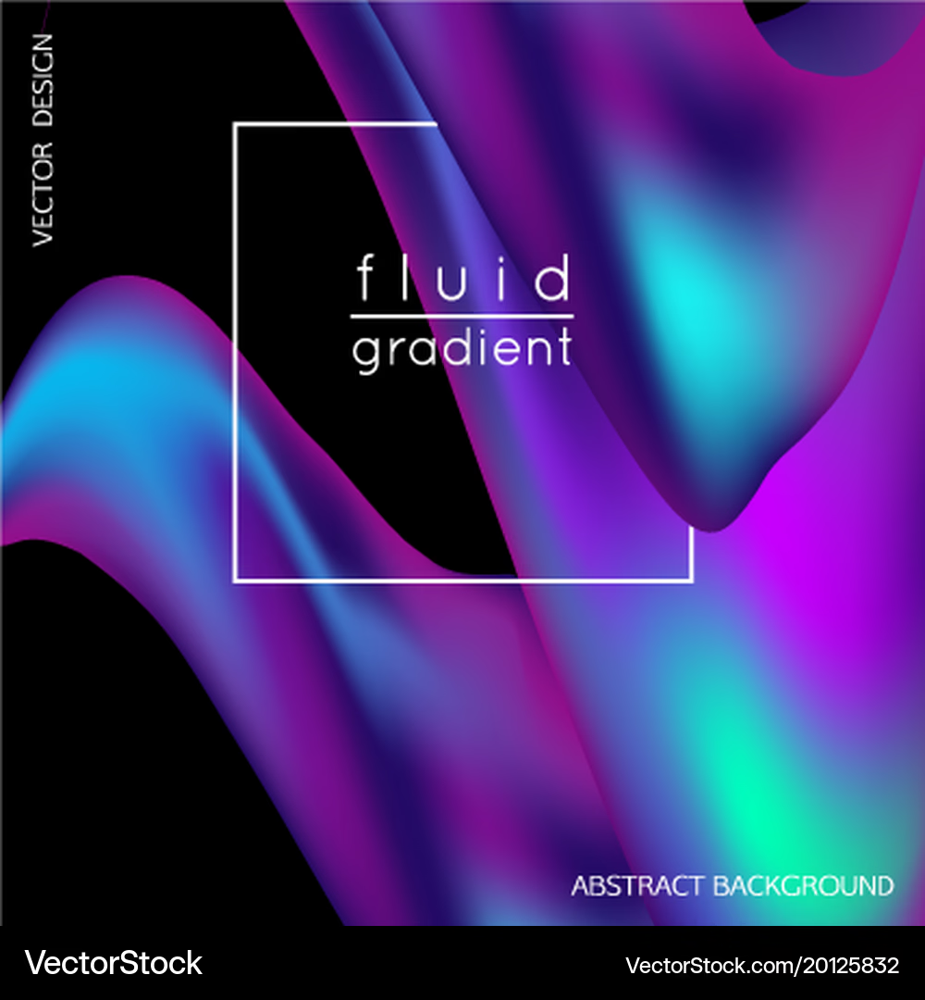

# quiz8
## patr1
- Imaging technology:Imaging Technique Inspiration
 - > This is my discussing.
  - I am drawn to __the smooth transitions and unpredictability of these fluid gradients__. This visual technique is commonly used in modern web design and dynamic posters, creating an organic and contemporary atmosphere. I would like to incorporate this effect into the background design of my major project to enhance the sense of depth and fluidity in the composition.

## patr2