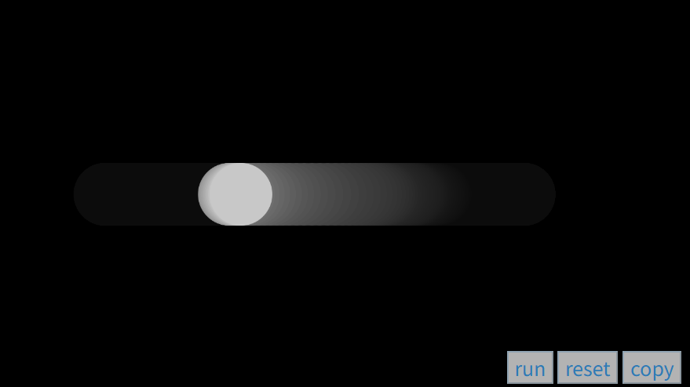

# quiz8
## part1
- __Imaging technology:Imaging Technique Inspiration__
 
   > This is my discussing.
  
   I am drawn to __the smooth transitions and unpredictability of these fluid gradients__. This visual technique is commonly used in modern web design and dynamic posters, creating an organic and contemporary atmosphere. I would like to incorporate this effect into the background design of my major project to enhance the sense of depth and fluidity in the composition.


## part2
- __Programming technique: the Perlin noise algorithm__

 Principle: Perlin noise is a coding technique used to generate smooth, random textures. Unlike standard random functions, the values it generates are spatially continuous, making it ideal for simulating the movement of water ripples, clouds or fluids. __In p5.js, the noise() function__ allows you to easily control colour shifts, enabling the fluid gradient effect mentioned in the first section.



- [Implementation Link](https://p5js.jp/examples/math-noise1d)
- [Source Code Link](https://p5js.jp/examples/math-noise1d)

```javascript
let xoff = 0.0;
let xincrement = 0.01;

function setup() {
  createCanvas(710, 400);
  background(0);
  noStroke();
}

function draw() {
  // Create an alpha blended background
  fill(0, 10);
  rect(0, 0, width, height);

  //let n = random(0,width);  // Try this line instead of noise

  // Get a noise value based on xoff and scale
  // it according to the window's width
  let n = noise(xoff) * width;

  // With each cycle, increment xoff
  xoff += xincrement;

  // Draw the ellipse at the value produced by perlin noise
  fill(200);
  ellipse(n, height / 2, 64, 64);
}
```
